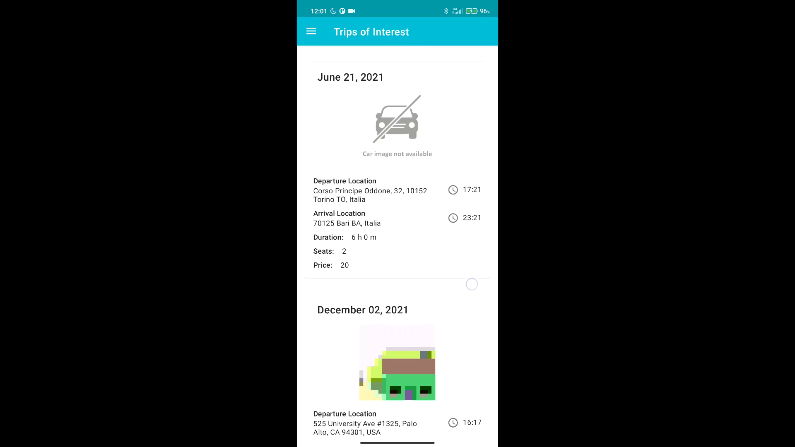
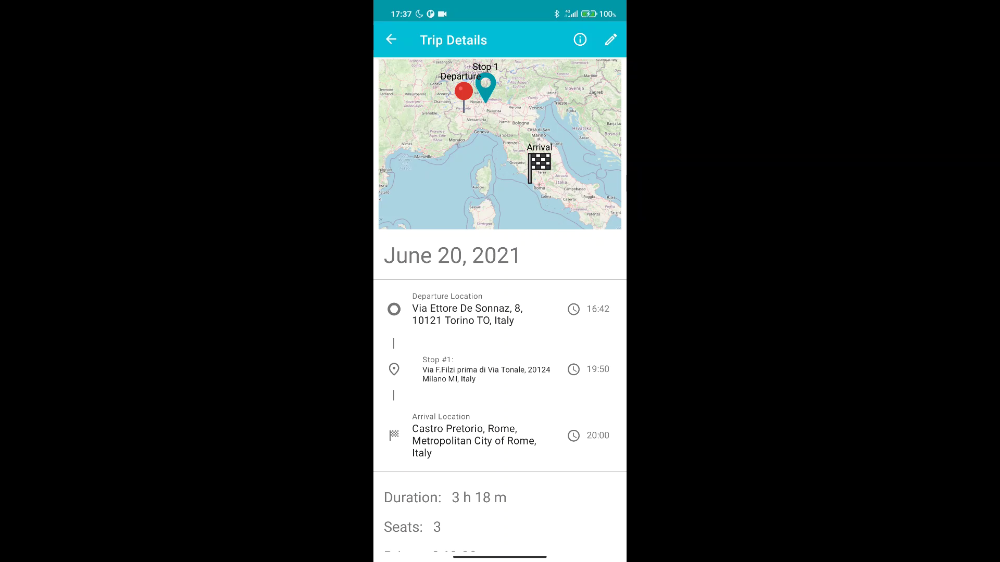
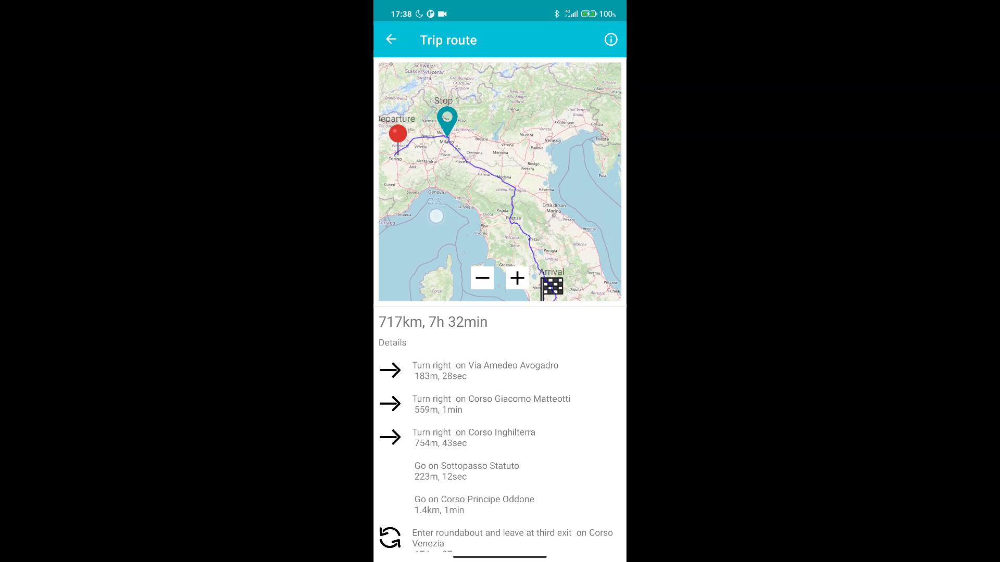
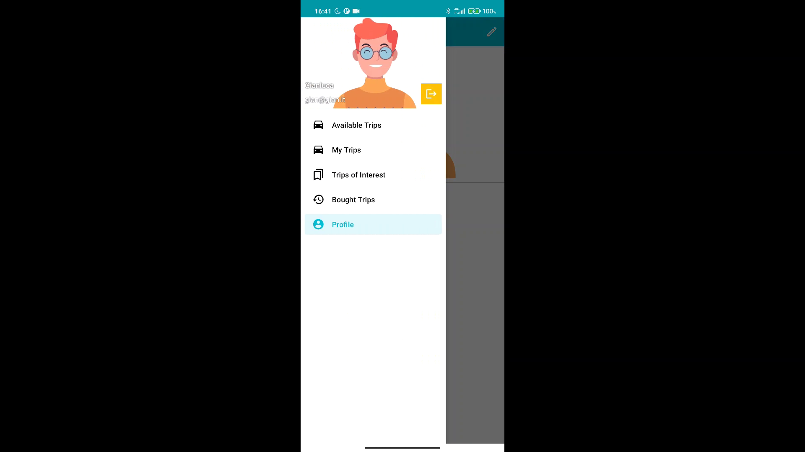
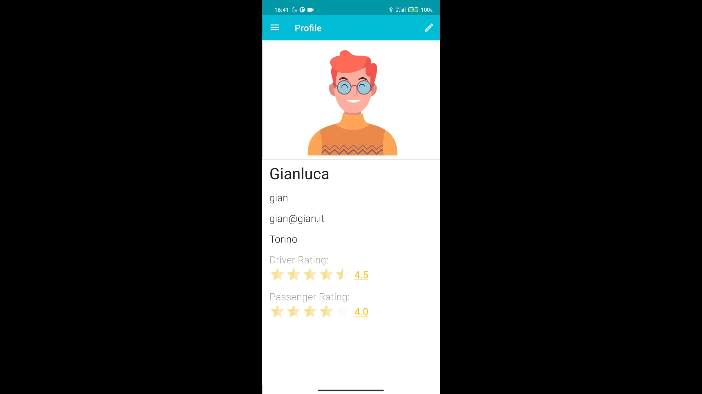
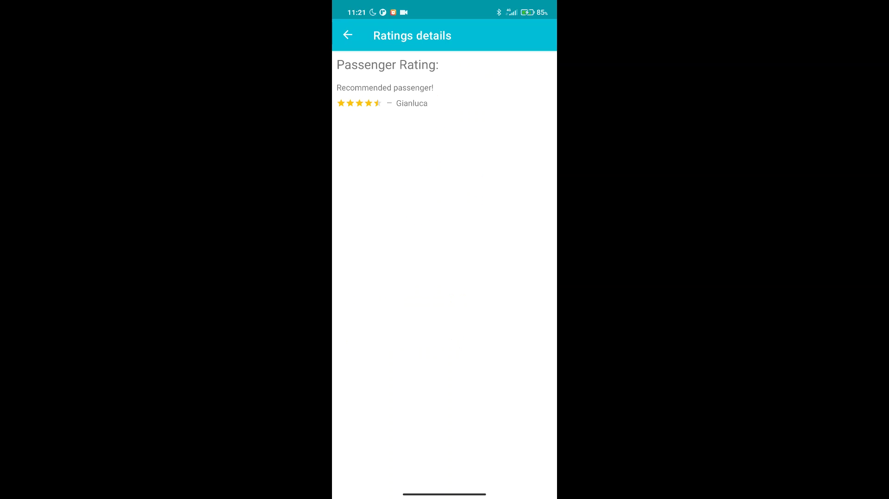

# Carpooling App
Authors: Mega Gianluca (s280109@studenti.polito.it), Panduri Santa (s280155@studenti.polito.it), Pappadà Matteo (s278078@studenti.polito.it), Zilli Cristian (s279002@studenti.polito.it).  
Carpooling App made for the Mobile Applications Development course of the Cybersecurity Polito Master's Degree.

## Contents

- [Abstract](#abstract)
- [High level design](#high-level-design)
- [Low level design](#low-level-design)

## Abstract

This app aims to help the users in their everyday trip managment thanks to the easy trip creation and booking, a precise search in the various trip views and an effective rating system all supported by Firestore and Google Authentication.
Every trip is fully viewable by the user who can set his/hers interest in booking a seat for it; the trip owner can later on accept or refuse the request in the modification page of the trip. 
After the trip's conclusion both driver and passengers are granted the possibility to express a rating with also an optional comment.
In every trip's page is also displayed a minimap with the related route: by tapping on it a fullscreen map is opened with the possibility to interact with it and with the instructions displayed below it.

## High Level design

We can distinguish all the app views in two major categories:
- views related to the users profiles
- views related to the trips

All the profiles can be viewed by anybody but with some sensitive data not shown for privacy concerns. Every user can modify, obviously, only his/hers own profile: this check is done internally when opening the profile details page. Along with all the personal data also the user's ratings (as driver and as passenger) are shown with the possibility to open the list of the related comments.

Different sections of the app are used for a precise trips grouping and visualization:
- Available trips, trips the user can book
- My Trips, trips created by the user
- Trips of interest, trips for which the user wants to book a seat
- Bought trips, trips for which the reservation has been accepted by the trip owner

The trip creation is suported by a page with a layout similar to the one used for the trip details. Users can set every location needed either by tapping directly on the map or writing the address in the text fields below it. Several checks are run after the Save button press in order to ensure the correctness of all the data inserted.

These trip managment pages are also used for posting ratings and comments after the trip completion. 

## Low level design

All the custom code is written in Kotlin, some third part libraries are used. 

Most of the servicies that the app offers are powered by Google Firebase:
- all the images are stored using Cloud Storage
- trips, profiles and all the related data are stored using Firestore
- the authentication is made with Firebase Authentication

The maps and the routes displayed are made using the Osmdroid(https://github.com/osmdroid/osmdroid/wiki) and OSMBonusPack(https://github.com/MKergall/osmbonuspack) libraries.

As you can see from the source code the app uses only one Activity that navigates between all the views described above (implemented as Fragments). 
The navigation is managed with a NavHostFragment displayed in the main activity in a Drawer architecture. 

The Firebase read calls are launched with Coroutines Flows and the received data are stored using LiveData and ViewModels. 

Images are loaded using Glide.  

## Screenshots 

